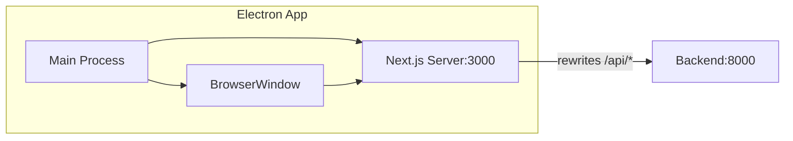

# Electron 打包 free-todo-frontend 方案

## 技术选型

**方案：Electron + 内嵌 Next.js 服务器**

- Electron 主进程启动 Next.js standalone 服务器
- BrowserWindow 加载 `http://localhost:3000`
- 保留 rewrites 功能，API 请求自动代理到 `localhost:8000`
- 使用 electron-builder 打包

## 架构流程



## 实现步骤

### 1. 修改 Next.js 配置

修改 [`next.config.mjs`](free-todo-frontend/next.config.mjs)，添加 standalone 输出模式：

```javascript
const nextConfig = {
  output: 'standalone',  // 添加这行
  reactStrictMode: true,
  // ... 其他配置保持不变
};
```

### 2. 创建 Electron 目录结构

```
free-todo-frontend/
├── electron/
│   ├── main.ts          # Electron 主进程
│   ├── preload.ts       # 预加载脚本（可选）
│   └── tsconfig.json    # Electron TypeScript 配置
├── package.json         # 添加 Electron 相关依赖和脚本
└── electron-builder.yml # 打包配置
```

### 3. 创建 Electron 主进程 (electron/main.ts)

关键逻辑：

- 开发模式：直接连接 `localhost:3000`（需手动启动 `pnpm dev`）
- 生产模式：从 `.next/standalone` 启动内嵌的 Next.js 服务器
- 等待服务器就绪后再创建窗口
```typescript
import { app, BrowserWindow } from 'electron';
import { spawn } from 'child_process';
import path from 'path';

const isDev = !app.isPackaged;
let nextProcess: ReturnType<typeof spawn> | null = null;

async function startNextServer(): Promise<void> {
  if (isDev) return; // 开发模式不需要启动

  const serverPath = path.join(process.resourcesPath, 'standalone', 'server.js');
  nextProcess = spawn('node', [serverPath], {
    env: { ...process.env, PORT: '3000' }
  });
}

function createWindow() {
  const win = new BrowserWindow({
    width: 1200,
    height: 800,
    webPreferences: { nodeIntegration: false, contextIsolation: true }
  });
  win.loadURL('http://localhost:3000');
}

app.whenReady().then(async () => {
  await startNextServer();
  // 等待服务器启动
  await waitForServer('http://localhost:3000', 30000);
  createWindow();
});

app.on('quit', () => {
  nextProcess?.kill();
});
```


### 4. 添加依赖和脚本

在 [`package.json`](free-todo-frontend/package.json) 中添加：

```json
{
  "main": "dist-electron/main.js",
  "scripts": {
    "electron:dev": "electron .",
    "electron:build": "pnpm build && electron-builder"
  },
  "devDependencies": {
    "electron": "^33.0.0",
    "electron-builder": "^25.0.0",
    "esbuild": "^0.24.0"
  }
}
```

### 5. 配置 electron-builder.yml

```yaml
appId: com.lifetrace.freetodo
productName: FreeTodo
directories:
  output: dist-electron-app

files:
  - "dist-electron/**/*"

extraResources:
  - from: ".next/standalone"
    to: "standalone"
  - from: ".next/static"
    to: "standalone/.next/static"
  - from: "public"
    to: "standalone/public"

win:
  target: nsis
  icon: public/logo.png

mac:
  target: dmg
  icon: public/logo.png

linux:
  target: AppImage
```

### 6. 构建脚本 (scripts/build-electron.js)

用于编译 Electron 主进程 TypeScript：

```javascript
const esbuild = require('esbuild');
esbuild.buildSync({
  entryPoints: ['electron/main.ts'],
  bundle: true,
  platform: 'node',
  outfile: 'dist-electron/main.js',
  external: ['electron']
});
```

## 打包命令

```bash
# 安装依赖
pnpm install

# 构建 Next.js
pnpm build

# 编译 Electron 主进程
node scripts/build-electron.js

# 打包应用
pnpm exec electron-builder
```

## 注意事项

1. **端口冲突**：确保 3000 和 8000 端口可用
2. **后端依赖**：应用启动前需要确保后端服务已运行
3. **环境变量**：可通过 `NEXT_PUBLIC_API_URL` 配置后端地址
4. **图标**：需要准备 256x256 以上的 PNG 或 ICO 图标

## 预计打包体积

- Windows (NSIS): 约 150-180MB
- macOS (DMG): 约 140-170MB
- Linux (AppImage): 约 150-180MB
