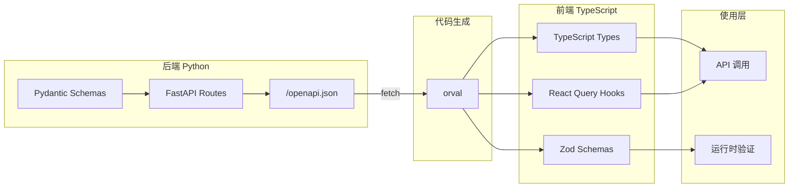
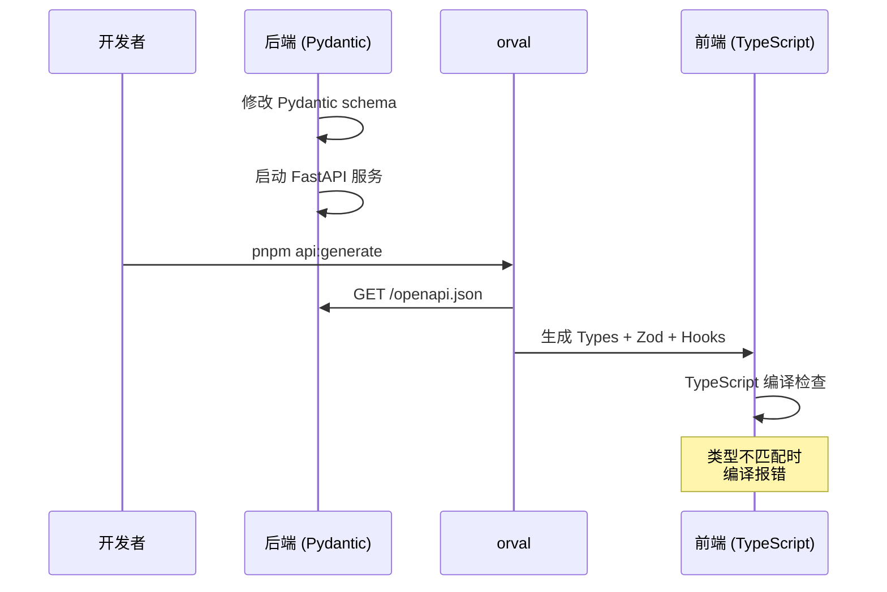

# OpenAPI 自动生成类型安全系统

## 架构概览



## 为什么选择 orval

| 工具 | 类型生成 | Zod | React Query | 维护状态 |

|------|---------|-----|-------------|---------|

| orval | 是 | 是 | 是 | 活跃 |

| openapi-zod-client | 是 | 是 | 否 | 活跃 |

| openapi-typescript | 是 | 否 | 否 | 活跃 |

orval 完美匹配你的技术栈（TanStack Query + TypeScript），且支持 Zod 验证。

---

## 实施步骤

### 第 1 步：安装依赖

在 [free-todo-frontend/package.json](free-todo-frontend/package.json) 中添加：

```bash
pnpm add zod
pnpm add -D orval
```

### 第 2 步：创建 orval 配置文件

新建 `free-todo-frontend/orval.config.ts`：

```typescript
import { defineConfig } from 'orval';

export default defineConfig({
  lifetrace: {
    input: {
      // 从后端获取 OpenAPI schema
      target: 'http://localhost:8000/openapi.json',
    },
    output: {
      // 生成文件的目标目录
      target: './lib/api/generated.ts',
      schemas: './lib/api/schemas',
      client: 'react-query',
      mode: 'tags-split', // 按 API tag 分割文件
      override: {
        mutator: {
          path: './lib/api/fetcher.ts',
          name: 'customFetcher',
        },
        // 生成 Zod schemas
        zod: {
          strict: {
            response: true,  // 响应使用严格验证
            body: true,      // 请求体使用严格验证
          },
          coerce: {
            // 自动转换日期字符串为标准格式
            date: true,
          },
        },
        query: {
          useQuery: true,
          useMutation: true,
        },
      },
    },
  },
});
```

### 第 3 步：创建自定义 fetcher

新建 `free-todo-frontend/lib/api/fetcher.ts` 处理时区标准化和错误处理：

```typescript
import { ZodSchema } from 'zod';

// 标准化时间字符串（处理无时区后缀问题）
function normalizeTimestamps(obj: unknown): unknown {
  if (obj === null || obj === undefined) return obj;
  if (typeof obj === 'string') {
    // ISO 时间格式但无时区，假设为 UTC
    if (/^\d{4}-\d{2}-\d{2}T\d{2}:\d{2}:\d{2}$/.test(obj)) {
      return `${obj}Z`;
    }
    return obj;
  }
  if (Array.isArray(obj)) {
    return obj.map(normalizeTimestamps);
  }
  if (typeof obj === 'object') {
    return Object.fromEntries(
      Object.entries(obj).map(([k, v]) => [k, normalizeTimestamps(v)])
    );
  }
  return obj;
}

export async function customFetcher<T>({
  url,
  method,
  params,
  data,
  responseSchema,
}: {
  url: string;
  method: string;
  params?: Record<string, unknown>;
  data?: unknown;
  responseSchema?: ZodSchema<T>;
}): Promise<T> {
  const baseUrl = typeof window !== 'undefined' ? '' : 'http://localhost:8000';

  const queryString = params
    ? '?' + new URLSearchParams(params as Record<string, string>).toString()
    : '';

  const response = await fetch(`${baseUrl}${url}${queryString}`, {
    method,
    headers: { 'Content-Type': 'application/json' },
    body: data ? JSON.stringify(data) : undefined,
  });

  if (!response.ok) {
    throw new Error(`API Error: ${response.status}`);
  }

  let json = await response.json();

  // 标准化时间字符串
  json = normalizeTimestamps(json);

  // 如果提供了 schema，进行验证
  if (responseSchema) {
    const result = responseSchema.safeParse(json);
    if (!result.success) {
      console.error('[API] Schema validation failed:', result.error.format());
      if (process.env.NODE_ENV === 'development') {
        throw new Error('Schema validation failed');
      }
    }
    return result.success ? result.data : json;
  }

  return json;
}
```

### 第 4 步：添加 npm scripts

在 [free-todo-frontend/package.json](free-todo-frontend/package.json) 的 scripts 中添加：

```json
{
  "scripts": {
    "api:generate": "orval",
    "api:generate:watch": "orval --watch"
  }
}
```

### 第 5 步：生成的文件结构

运行 `pnpm api:generate` 后，将生成：

```
lib/api/
├── fetcher.ts              # 自定义 fetcher（手动创建）
├── generated.ts            # 入口文件
└── schemas/
    ├── todo.ts             # Todo 相关类型 + Zod
    ├── todo.zod.ts         # Todo Zod schemas
    ├── activity.ts         # Activity 相关
    ├── event.ts            # Event 相关
    └── ...                 # 其他 API tags
```

### 第 6 步：迁移现有代码

逐步将 [lib/api.ts](free-todo-frontend/lib/api.ts) 中的手动类型替换为生成的类型：

```typescript
// 之前（手动定义）
export type ApiTodo = { ... };

// 之后（使用生成的类型）
export type { TodoResponse as ApiTodo } from './api/schemas/todo';

// 或直接使用生成的 hooks
import { useTodos, useCreateTodo } from './api/generated';
```

### 第 7 步：修复时区问题的根本方案

在生成的 Zod schema 基础上，可以自定义 datetime 处理：

```typescript
// lib/api/schemas/overrides.ts
import { z } from 'zod';

// 覆盖默认的 datetime schema
export const safeDateTime = z.string().transform((val) => {
  if (val && !val.includes('Z') && !val.includes('+')) {
    return `${val}Z`;
  }
  return val;
});
```

---

## 日常工作流



---

## 预期收益

1. **类型安全**：前后端类型自动同步，编译时发现不匹配
2. **运行时验证**：Zod schemas 在运行时验证 API 响应
3. **时区问题防范**：统一在 fetcher 层处理时区标准化
4. **AI 响应验证**：可以为 AI 相关 API 添加额外的 Zod 验证
5. **开发效率**：自动生成 React Query hooks，减少样板代码
