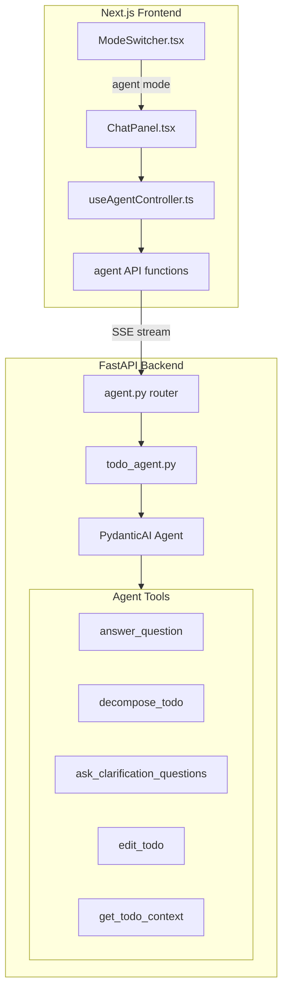
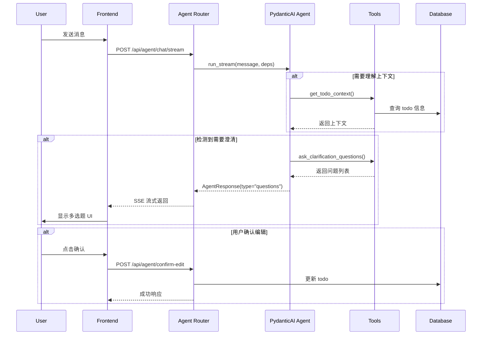

# PydanticAI Todo Agent 实现计划

## 架构概览




## 1. 后端：PydanticAI Agent 模块

### 1.1 安装 PydanticAI 依赖

在 [`pyproject.toml`](pyproject.toml) 中添加：

```toml
"pydantic-ai>=0.0.30",
```


### 1.2 创建 Agent 核心模块

**新建文件：** `lifetrace/llm/todo_agent.py`

```python
from pydantic import BaseModel
from pydantic_ai import Agent, RunContext

# 结构化输出类型
class AgentResponse(BaseModel):
    response_type: str  # "message" | "questions" | "edit_proposal" | "decompose_proposal"
    content: str
    questions: list[Question] | None = None
    edit_proposal: EditProposal | None = None
    decompose_proposal: DecomposeProposal | None = None

# 依赖注入类型
class TodoAgentDeps:
    todo_id: int | None
    todo_context: dict
    conversation_history: list[dict]

# 创建 Agent
todo_agent = Agent(
    'openai:gpt-4o',
    result_type=AgentResponse,
    deps_type=TodoAgentDeps,
    system_prompt="你是一个专业的任务管理助手..."
)
```


### 1.3 定义 Agent 工具

在 `todo_agent.py` 中定义 5 个核心工具：| 工具 | 功能 ||------|------|| `get_todo_context` | 获取当前 todo 的完整上下文（父任务、子任务、描述等） || `ask_clarification_questions` | 生成不超过 5 个多选题来理清 todo 概念 || `propose_decomposition` | 提议将 todo 拆解为子任务 || `propose_edit` | 提议编辑 todo 的 name/description/user_notes || `execute_edit` | 用户确认后执行编辑操作 |

### 1.4 创建 Agent Router

**新建文件：** `lifetrace/routers/agent.py`主要端点：

- `POST /api/agent/chat/stream` - 流式对话端点
- `POST /api/agent/confirm-edit` - 确认编辑操作
- `POST /api/agent/confirm-decompose` - 确认拆解操作

## 2. 后端：Prompt 配置

在 [`lifetrace/config/prompt.yaml`](lifetrace/config/prompt.yaml) 中添加 `todo_agent` 部分：

```yaml
todo_agent:
  system_prompt: |
    你是一个专业的任务管理助手（Todo Agent）。你的核心能力包括：

    1. **理解上下文**：深入理解用户选中的 todo 的背景和目的
    2. **智能问答**：回答关于 todo 的问题
    3. **任务拆解**：当检测到复杂任务时，主动询问是否需要拆解
    4. **澄清概念**：通过不超过 5 个多选题帮助理清模糊的任务
    5. **编辑建议**：提议修改 todo 的名称、描述或备注（需用户确认）

    **行为准则：**
    - 始终先理解 todo 的背景和目的
    - 编辑操作必须先提出建议，获得用户确认后才能执行
    - 拆解建议要具体可执行，子任务数量控制在 2-5 个
    - 多选题要聚焦于任务的关键决策点

  clarification_prompt: |
    请生成不超过 5 个多选题...

  decompose_prompt: |
    请将任务拆解为子任务...
```


## 3. 前端：类型和 API

### 3.1 扩展 ChatMode 类型

**修改文件：** [`free-todo-frontend/apps/chat/types.ts`](free-todo-frontend/apps/chat/types.ts)

```typescript
export type ChatMode = "ask" | "plan" | "edit" | "agent";

// Agent 模式专用类型
export type AgentResponseType =
  | "message"
  | "questions"
  | "edit_proposal"
  | "decompose_proposal";

export type AgentQuestion = {
  id: string;
  question: string;
  options: string[];
};

export type AgentEditProposal = {
  field: "name" | "description" | "userNotes";
  currentValue: string | null;
  proposedValue: string;
  reason: string;
};

export type AgentDecomposeProposal = {
  subtasks: Array<{
    name: string;
    description?: string;
  }>;
  reason: string;
};
```


### 3.2 创建 Agent API 函数

**修改文件：** [`free-todo-frontend/lib/api.ts`](free-todo-frontend/lib/api.ts)添加 Agent 专用的流式 API 函数：

- `sendAgentMessageStream()` - 发送消息给 Agent
- `confirmAgentEdit()` - 确认编辑提议
- `confirmAgentDecompose()` - 确认拆解提议

### 3.3 创建 Agent Controller Hook

**新建文件：** `free-todo-frontend/apps/chat/hooks/useAgentController.ts`管理 Agent 模式的状态和交互逻辑：

- 处理流式响应解析
- 管理待确认的编辑/拆解提议
- 处理多选题问答流程

## 4. 前端：UI 组件

### 4.1 更新 ModeSwitcher

**修改文件：** [`free-todo-frontend/apps/chat/ModeSwitcher.tsx`](free-todo-frontend/apps/chat/ModeSwitcher.tsx)在模式列表中添加 "agent" 选项。

### 4.2 创建 Agent 专用 UI 组件

**新建文件：**

- `AgentQuestions.tsx` - 显示澄清问题的多选题 UI
- `AgentEditProposal.tsx` - 显示编辑提议并提供确认/拒绝按钮
- `AgentDecomposeProposal.tsx` - 显示拆解提议并提供确认/拒绝按钮

### 4.3 更新 ChatPanel

**修改文件：** [`free-todo-frontend/apps/chat/ChatPanel.tsx`](free-todo-frontend/apps/chat/ChatPanel.tsx)在 `chatMode === "agent"` 时使用 `useAgentController` 和 Agent 专用组件。

## 5. 国际化

**修改文件：** [`free-todo-frontend/lib/i18n/messages/zh.json`](free-todo-frontend/lib/i18n/messages/zh.json) 和 `en.json`添加 Agent 模式的翻译键：

```json
{
  "chat": {
    "modes": {
      "agent": {
        "label": "智能助手",
        "description": "AI助手帮你拆解、编辑和管理任务"
      }
    },
    "agent": {
      "confirmEdit": "确认修改",
      "rejectEdit": "取消",
      "confirmDecompose": "确认拆解",
      "editProposalTitle": "AI建议修改",
      "decomposeProposalTitle": "AI建议拆解为以下子任务"
    }
  }
}
```


## 关键实现细节

### Agent 对话流程




### 现有代码复用

- 复用 [`lifetrace/storage/todo_mgr.py`](lifetrace/storage/todo_mgr.py) 的 `get_todo_context()` 方法获取 todo 上下文
- 复用 [`chat.py`](lifetrace/routers/chat.py) 的流式响应模式
- 复用现有的 [`Questionnaire.tsx`](free-todo-frontend/apps/chat/Questionnaire.tsx) 组件样式

### 编辑确认机制

Agent 提议编辑时：

1. Agent 返回 `response_type: "edit_proposal"` 和具体提议
