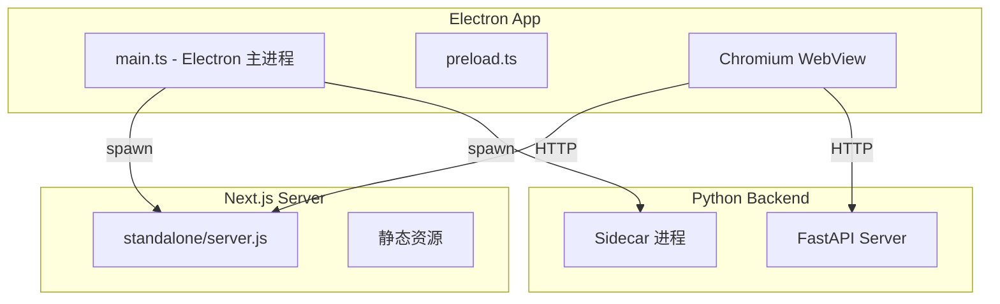
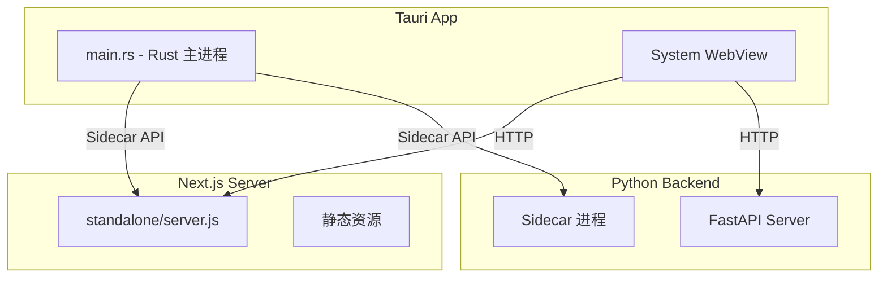

# Tauri 替代 Electron 迁移方案

## 当前架构



## 目标架构



## 迁移策略

采用 **HTTP Sidecar 模式**：

- Python 后端作为独立 Sidecar 进程运行
- 前端通过 HTTP 直接访问 FastAPI
- Rust 主进程负责启动/管理 Sidecar 进程
- 前端代码和后端 API 几乎不需要改动

---

## 第一步：创建 Tauri 项目结构

在 `free-todo-frontend/` 目录下初始化 Tauri：

```
free-todo-frontend/
├── src-tauri/              # 新增：Tauri Rust 代码
│   ├── Cargo.toml
│   ├── tauri.conf.json
│   ├── src/
│   │   ├── main.rs
│   │   ├── backend.rs      # Python 后端管理
│   │   ├── nextjs.rs       # Next.js 服务器管理
│   │   └── lib.rs
│   └── icons/
├── electron/               # 保留：可选择性删除或并行维护
├── app/                    # 不变：Next.js 前端
└── ...
```

**命令**：

```bash
cd free-todo-frontend
pnpm add -D @tauri-apps/cli@latest
pnpm tauri init
```

---

## 第二步：配置 tauri.conf.json

```json
{
  "$schema": "https://schema.tauri.app/config/2.1",
  "productName": "FreeTodo",
  "version": "0.1.0",
  "identifier": "com.freeugroup.freetodo",
  "build": {
    "beforeBuildCommand": "pnpm build",
    "devUrl": "http://localhost:3000",
    "frontendDist": "../.next/standalone"
  },
  "app": {
    "withGlobalTauri": true,
    "windows": [
      {
        "title": "FreeTodo",
        "width": 1200,
        "height": 800,
        "resizable": true,
        "fullscreen": false
      }
    ],
    "security": {
      "csp": null
    }
  },
  "bundle": {
    "active": true,
    "icon": ["icons/icon.png"],
    "targets": ["dmg", "nsis", "appimage"],
    "externalBin": ["backend/lifetrace"],
    "resources": ["standalone/**/*", "backend/**/*"]
  }
}
```

---

## 第三步：实现 Rust 主进程

### 3.1 主入口 (src/main.rs)

```rust
#![cfg_attr(not(debug_assertions), windows_subsystem = "windows")]

mod backend;
mod nextjs;

use tauri::Manager;

fn main() {
    tauri::Builder::default()
        .setup(|app| {
            let handle = app.handle().clone();

            // 启动 Python 后端
            tauri::async_runtime::spawn(async move {
                if let Err(e) = backend::start_backend(&handle).await {
                    eprintln!("Failed to start backend: {}", e);
                }
            });

            // 启动 Next.js 服务器（打包模式）
            #[cfg(not(debug_assertions))]
            tauri::async_runtime::spawn(async move {
                if let Err(e) = nextjs::start_nextjs(&handle).await {
                    eprintln!("Failed to start Next.js: {}", e);
                }
            });

            Ok(())
        })
        .run(tauri::generate_context!())
        .expect("error while running tauri application");
}
```

### 3.2 Python 后端管理 (src/backend.rs)

```rust
use std::process::Command;
use std::path::PathBuf;
use tauri::AppHandle;

pub async fn start_backend(app: &AppHandle) -> Result<(), Box<dyn std::error::Error>> {
    let resource_path = app.path().resource_dir()?;
    let backend_path = resource_path.join("backend").join("lifetrace");
    let data_dir = app.path().app_data_dir()?;

    // 检测是否已有后端运行
    if check_backend_health(8001).await {
        println!("Backend already running on port 8001");
        return Ok(());
    }

    // 启动后端进程
    let mut cmd = Command::new(&backend_path);
    cmd.args(["--port", "8001", "--data-dir", data_dir.to_str().unwrap()]);
    cmd.spawn()?;

    // 等待后端就绪
    wait_for_backend(8001, 30).await?;

    Ok(())
}

async fn check_backend_health(port: u16) -> bool {
    let url = format!("http://127.0.0.1:{}/health", port);
    reqwest::get(&url).await.map(|r| r.status().is_success()).unwrap_or(false)
}

async fn wait_for_backend(port: u16, timeout_secs: u64) -> Result<(), &'static str> {
    for _ in 0..timeout_secs * 2 {
        if check_backend_health(port).await {
            return Ok(());
        }
        tokio::time::sleep(std::time::Duration::from_millis(500)).await;
    }
    Err("Backend did not start in time")
}
```

---

## 第四步：功能迁移对照表

| Electron 模块 | Tauri 对应 | 迁移方式 |

|--------------|-----------|---------|

| [`main.ts`](free-todo-frontend/electron/main.ts) | `src/main.rs` | 重写（Rust） |

| [`backend-server.ts`](free-todo-frontend/electron/backend-server.ts) | `src/backend.rs` | 重写（Rust） |

| [`next-server.ts`](free-todo-frontend/electron/next-server.ts) | `src/nextjs.rs` | 重写（Rust） |

| [`window-manager.ts`](free-todo-frontend/electron/window-manager.ts) | `tauri.conf.json` | 配置化 |

| [`tray-manager.ts`](free-todo-frontend/electron/tray-manager.ts) | Tauri SystemTray API | 重写（Rust） |

| [`global-shortcut-manager.ts`](free-todo-frontend/electron/global-shortcut-manager.ts) | Tauri GlobalShortcut Plugin | 重写（Rust） |

| [`ipc-handlers.ts`](free-todo-frontend/electron/ipc-handlers.ts) | Tauri Commands | 按需迁移 |

| [`preload.ts`](free-todo-frontend/electron/preload.ts) | `withGlobalTauri` | 不需要 |

| [`config.ts`](free-todo-frontend/electron/config.ts) | Rust 配置模块 | 重写（Rust） |

---

## 第五步：打包配置

### 5.1 Cargo.toml 依赖

```toml
[dependencies]
tauri = { version = "2", features = ["tray-icon", "protocol-asset"] }
tauri-plugin-shell = "2"
tauri-plugin-notification = "2"
tauri-plugin-global-shortcut = "2"
tokio = { version = "1", features = ["full"] }
reqwest = { version = "0.12", features = ["json"] }
serde = { version = "1", features = ["derive"] }
serde_json = "1"

[build-dependencies]
tauri-build = "2"
```

### 5.2 打包脚本更新

修改 [`package.json`](free-todo-frontend/package.json)：

```json
{
  "scripts": {
    "tauri:dev": "tauri dev",
    "tauri:build": "pnpm build && pnpm backend:build && tauri build",
    "tauri:build-win": "pnpm build && pnpm backend:build:win && tauri build --target x86_64-pc-windows-msvc",
    "tauri:build-mac": "pnpm build && pnpm backend:build && tauri build --target universal-apple-darwin",
    "tauri:build-linux": "pnpm build && pnpm backend:build && tauri build --target x86_64-unknown-linux-gnu"
  }
}
```

---

## 第六步：前端适配

### 6.1 环境检测

修改前端代码检测运行环境：

```typescript
// lib/utils/platform.ts
export const isTauri = () => {
  return typeof window !== 'undefined' && '__TAURI__' in window;
};

export const isElectron = () => {
  return typeof window !== 'undefined' &&
    typeof window.process !== 'undefined' &&
    window.process.type === 'renderer';
};
```

### 6.2 API 调用保持不变

由于采用 HTTP Sidecar 模式，前端的 API 调用方式**完全不变**：

```typescript
// 现有代码继续使用，无需修改
const response = await fetch('http://localhost:8001/api/todos');
```

---

## 第七步：构建流程

### 7.1 开发模式

```bash
# 终端 1：启动 Python 后端
cd lifetrace && python -m lifetrace.server

# 终端 2：启动 Next.js 开发服务器
cd free-todo-frontend && pnpm dev

# 终端 3：启动 Tauri 开发模式
cd free-todo-frontend && pnpm tauri dev
```

### 7.2 生产构建

```bash
cd free-todo-frontend

# 1. 构建 Next.js standalone
pnpm build

# 2. 构建 Python 后端（PyInstaller）
pnpm backend:build

# 3. 构建 Tauri 应用
pnpm tauri build
```

---

## 预期收益

| 指标 | Electron 现状 | Tauri 预期 |

|-----|--------------|-----------|

| 前端体积 | 150-200 MB (Chromium) | 3-10 MB (System WebView) |

| 内存占用 | 200-400 MB | 50-100 MB |

| 启动速度 | 3-4 秒 | 1-2 秒 |

| 总打包体积 | 2.6 GB | 2.4-2.5 GB |

注：总体积减少有限，因为 Python 后端体积不变。主要收益在启动速度和内存占用。

---

## 风险与注意事项

1. **Rust 学习曲线**：需要学习 Rust 基础语法
2. **系统 WebView 兼容性**：

   - Windows: WebView2 (Edge)，需要用户安装（Win11 内置）
   - macOS: WKWebView（系统内置）
   - Linux: WebKitGTK（需要安装）

3. **Island 模式**：Tauri 的无边框窗口支持有差异，需要适配
4. **全局快捷键**：Tauri 插件 API 与 Electron 略有不同
5. **IPC 通信**：如果有 Electron IPC 调用，需要迁移到 Tauri Commands

---

## 迁移步骤清单

1. 初始化 Tauri 项目（`pnpm tauri init`）
2. 配置 `tauri.conf.json`
3. 实现 Rust 主进程（`main.rs`）
4. 实现后端管理模块（`backend.rs`）
5. 实现 Next.js 服务器管理（`nextjs.rs`）
6. 实现系统托盘（Tauri SystemTray）
7. 实现全局快捷键（Tauri GlobalShortcut Plugin）
8. 测试开发模式运行
9. 测试生产构建
10. 跨平台测试（Windows/macOS/Linux）
