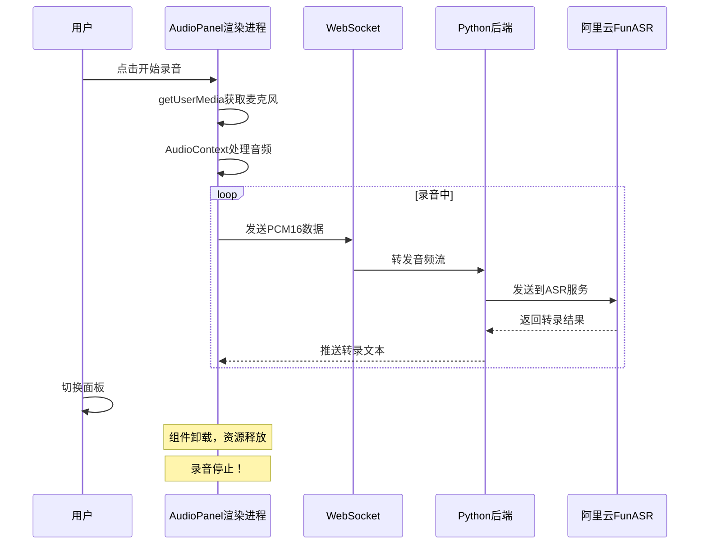
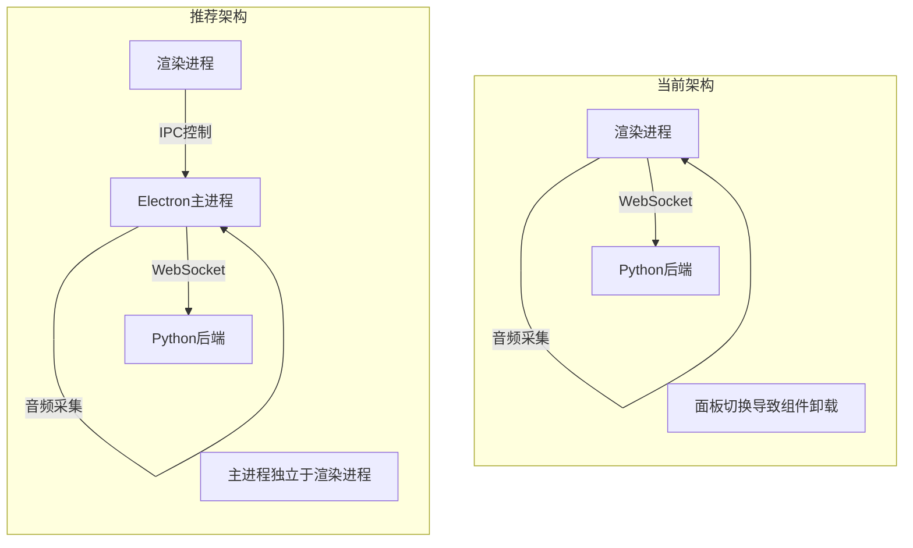

# 后台持续录音方案分析

## 当前架构



**问题根源**：录音资源（WebSocket、AudioContext、MediaStream）都在 `AudioPanel` 组件内部，组件卸载时资源被释放。

---

## 方案 3：Python 后端驱动录音

### 需要改造的内容

1. **启用 PyAudio 进行系统级音频采集**

   - 文件：[lifetrace/services/audio_service.py](lifetrace/services/audio_service.py)
   - 新增：音频录制线程/协程
   - 依赖：`pyaudio>=0.2.14`（已声明但未使用）

2. **新增后端录音管理 API**

   - `POST /api/audio/recording/start` - 启动录音
   - `POST /api/audio/recording/stop` - 停止录音
   - `GET /api/audio/recording/status` - 获取录音状态
   - WebSocket 仅用于推送转录结果，不再接收音频

3. **跨平台音频设备访问**

   - Windows：需要安装 PyAudio 的 Windows 预编译包
   - macOS：需要 PortAudio 库
   - Linux：需要 ALSA 开发库

4. **前端改造**

   - 移除 `useAudioRecording` 中的音频采集逻辑
   - 改为调用后端 API 控制录音
   - WebSocket 只接收转录结果

### 为什么改造范围大

| 改造点 | 复杂度 | 原因 |

|--------|--------|------|

| PyAudio 跨平台部署 | 高 | 需要编译原生依赖，不同 OS 配置不同 |

| 音频设备权限管理 | 高 | Python 进程需要独立申请麦克风权限 |

| 后端架构变化 | 中 | 从无状态变为有状态（持有录音资源） |

| 前后端接口重构 | 中 | WebSocket 协议从双向音频流变为单向推送 |

---

## 推荐方案：Electron 主进程驱动录音（方案 3 的变体）

由于这是一个 Electron 桌面应用，**在 Electron 主进程中实现录音**是更优的选择。

### 架构对比



### 为什么更优

1. **Electron 主进程独立运行**：不受渲染进程中的 React 组件生命周期影响
2. **已有预留接口**：`tray-manager.ts` 中已有 `startRecording()`/`stopRecording()` 占位符
3. **IPC 机制完善**：已有成熟的 `contextBridge` + `ipcMain/ipcRenderer` 通信
4. **无需跨平台编译**：Electron 自身处理了跨平台问题

### 需要改造的内容

1. **Electron 主进程**（约 200-300 行代码）

   - 新增 [electron/audio-recorder.ts](free-todo-frontend/electron/audio-recorder.ts)：使用 `node-record-lpcm16` 或 `node-microphone` 录音
   - 修改 [electron/ipc-handlers.ts](free-todo-frontend/electron/ipc-handlers.ts)：添加录音控制 IPC 通道
   - 修改 [electron/preload.ts](free-todo-frontend/electron/preload.ts)：暴露录音 API

2. **前端组件**（约 50-100 行代码）

   - 修改 [apps/audio/hooks/useAudioRecording.ts](free-todo-frontend/apps/audio/hooks/useAudioRecording.ts)：改用 IPC 调用主进程录音
   - 可选：添加全局录音状态 store

3. **后端无需改动**：继续通过 WebSocket 接收音频流

### IPC 通道设计

```typescript
// 新增 IPC 通道
'audio:start-recording'   // 开始录音
'audio:stop-recording'    // 停止录音
'audio:recording-status'  // 录音状态变化（主进程 → 渲染进程）
'audio:transcription'     // 转录结果推送（主进程 → 渲染进程）
```

---

## 两种方案对比

| 维度 | Python 后端驱动 | Electron 主进程驱动（推荐） |

|------|----------------|---------------------------|

| 改造范围 | 大（前后端 + 跨平台编译） | 中（仅前端 Electron 层） |

| 跨平台兼容性 | 需要处理 PyAudio 部署 | Electron 原生支持 |

| 架构变化 | 后端从无状态变有状态 | 仅前端内部调整 |

| 复用现有代码 | 较少 | 复用 IPC、WebSocket 等 |

| 开发周期 | 较长 | 较短 |

---

## 结论

**如果您追求最小改动量**，推荐使用 **Electron 主进程驱动录音** 方案。它保持了现有的前后端分离架构，只在 Electron 层做改动，且 Electron 主进程天然不受面板切换影响。

**如果您有其他考虑**（如支持纯 Web 版本、与后端深度集成等），再考虑 Python 后端驱动方案。
