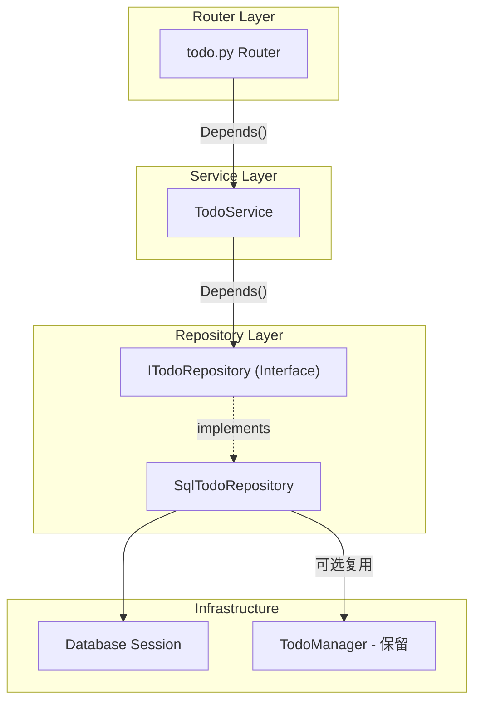

# 后端架构重构方案

## 目标架构



---

## 第一部分：解决启动缓慢

### 问题

[`server.py`](lifetrace/server.py) 第94-104行同步加载向量服务和RAG服务，耗时30秒以上。

### 方案：延迟加载单例

创建 [`lifetrace/core/lazy_services.py`](lifetrace/core/lazy_services.py)（新文件）：

```python
from functools import lru_cache
from typing import TYPE_CHECKING

if TYPE_CHECKING:
    from lifetrace.llm.vector_service import VectorService
    from lifetrace.llm.rag_service import RAGService

_vector_service = None
_rag_service = None

def get_vector_service() -> "VectorService":
    """延迟加载向量服务 - 首次访问时初始化"""
    global _vector_service
    if _vector_service is None:
        from lifetrace.llm.vector_service import create_vector_service
        from lifetrace.util.config import config
        _vector_service = create_vector_service(config)
    return _vector_service

def get_rag_service() -> "RAGService":
    """延迟加载 RAG 服务 - 首次访问时初始化"""
    global _rag_service
    if _rag_service is None:
        from lifetrace.llm.rag_service import RAGService
        _rag_service = RAGService()
    return _rag_service
```


### 修改 server.py

删除启动时的同步初始化，改为按需加载：

```python
# 删除这些行：
# vector_service = create_vector_service(config)
# rag_service = RAGService()

# 改为在需要时通过依赖注入获取
```

---

## 第二部分：建立依赖注入基础

### 创建依赖注入模块

创建 [`lifetrace/core/dependencies.py`](lifetrace/core/dependencies.py)（新文件）：

```python
from typing import Generator
from fastapi import Depends
from sqlalchemy.orm import Session

from lifetrace.storage.database_base import DatabaseBase

# 数据库基础实例（轻量，保持单例）
_db_base = None

def get_db_base() -> DatabaseBase:
    global _db_base
    if _db_base is None:
        _db_base = DatabaseBase()
    return _db_base

def get_db_session(db_base: DatabaseBase = Depends(get_db_base)) -> Generator[Session, None, None]:
    """获取数据库会话 - 请求级别生命周期"""
    session = db_base.SessionLocal()
    try:
        yield session
        session.commit()
    except Exception:
        session.rollback()
        raise
    finally:
        session.close()
```

---

## 第三部分：为 todo 模块引入 Repository Pattern

### 3.1 创建 Repository 接口

创建 [`lifetrace/repositories/interfaces.py`](lifetrace/repositories/interfaces.py)（新文件）：

```python
from abc import ABC, abstractmethod
from typing import Any
from datetime import datetime

class ITodoRepository(ABC):
    """Todo 仓库接口"""

    @abstractmethod
    def get_by_id(self, todo_id: int) -> dict[str, Any] | None:
        """根据ID获取单个todo"""
        pass

    @abstractmethod
    def list_todos(self, limit: int, offset: int, status: str | None) -> list[dict[str, Any]]:
        """获取todo列表"""
        pass

    @abstractmethod
    def count(self, status: str | None) -> int:
        """统计todo数量"""
        pass

    @abstractmethod
    def create(self, **kwargs) -> int | None:
        """创建todo，返回ID"""
        pass

    @abstractmethod
    def update(self, todo_id: int, **kwargs) -> bool:
        """更新todo"""
        pass

    @abstractmethod
    def delete(self, todo_id: int) -> bool:
        """删除todo"""
        pass

    @abstractmethod
    def reorder(self, items: list[dict[str, Any]]) -> bool:
        """批量重排序"""
        pass
```


### 3.2 创建 Repository 实现

创建 [`lifetrace/repositories/sql_todo_repository.py`](lifetrace/repositories/sql_todo_repository.py)（新文件）：

```python
from sqlalchemy.orm import Session
from lifetrace.repositories.interfaces import ITodoRepository
from lifetrace.storage.todo_manager import TodoManager
from lifetrace.storage.database_base import DatabaseBase

class SqlTodoRepository(ITodoRepository):
    """基于 SQLAlchemy 的 Todo 仓库实现"""

    def __init__(self, db_base: DatabaseBase):
        # 复用现有的 TodoManager 逻辑
        self._manager = TodoManager(db_base)

    def get_by_id(self, todo_id: int):
        return self._manager.get_todo(todo_id)

    def list_todos(self, limit: int, offset: int, status: str | None):
        return self._manager.list_todos(limit=limit, offset=offset, status=status)

    def count(self, status: str | None) -> int:
        return self._manager.count_todos(status=status)

    def create(self, **kwargs) -> int | None:
        return self._manager.create_todo(**kwargs)

    def update(self, todo_id: int, **kwargs) -> bool:
        return self._manager.update_todo(todo_id, **kwargs)

    def delete(self, todo_id: int) -> bool:
        return self._manager.delete_todo(todo_id)

    def reorder(self, items: list) -> bool:
        return self._manager.reorder_todos(items)
```


### 3.3 创建 Service 层

创建 [`lifetrace/services/todo_service.py`](lifetrace/services/todo_service.py)（新文件）：

```python
from fastapi import HTTPException
from lifetrace.repositories.interfaces import ITodoRepository
from lifetrace.schemas.todo import TodoCreate, TodoUpdate, TodoResponse
from lifetrace.util.logging_config import get_logger

logger = get_logger()

class TodoService:
    """Todo 业务逻辑层"""

    def __init__(self, repository: ITodoRepository):
        self.repository = repository

    def get_todo(self, todo_id: int) -> TodoResponse:
        todo = self.repository.get_by_id(todo_id)
        if not todo:
            raise HTTPException(status_code=404, detail="todo 不存在")
        return TodoResponse(**todo)

    def list_todos(self, limit: int, offset: int, status: str | None):
        todos = self.repository.list_todos(limit, offset, status)
        total = self.repository.count(status)
        return {"total": total, "todos": [TodoResponse(**t) for t in todos]}

    def create_todo(self, data: TodoCreate) -> TodoResponse:
        todo_id = self.repository.create(
            name=data.name,
            description=data.description,
            user_notes=data.user_notes,
            parent_todo_id=data.parent_todo_id,
            deadline=data.deadline,
            start_time=data.start_time,
            status=data.status.value if data.status else "active",
            priority=data.priority.value if data.priority else "none",
            order=data.order,
            tags=data.tags,
            related_activities=data.related_activities,
        )
        if not todo_id:
            raise HTTPException(status_code=500, detail="创建 todo 失败")

        return self.get_todo(todo_id)

    def update_todo(self, todo_id: int, data: TodoUpdate) -> TodoResponse:
        # 检查是否存在
        if not self.repository.get_by_id(todo_id):
            raise HTTPException(status_code=404, detail="todo 不存在")

        # 提取有效字段
        fields_set = getattr(data, "model_fields_set", set())
        kwargs = {field: getattr(data, field) for field in fields_set}

        # 枚举转字符串
        if "status" in kwargs and kwargs["status"]:
            kwargs["status"] = kwargs["status"].value
        if "priority" in kwargs and kwargs["priority"]:
            kwargs["priority"] = kwargs["priority"].value

        if not self.repository.update(todo_id, **kwargs):
            raise HTTPException(status_code=500, detail="更新 todo 失败")

        return self.get_todo(todo_id)

    def delete_todo(self, todo_id: int) -> None:
        if not self.repository.get_by_id(todo_id):
            raise HTTPException(status_code=404, detail="todo 不存在")
        if not self.repository.delete(todo_id):
            raise HTTPException(status_code=500, detail="删除 todo 失败")

    def reorder_todos(self, items: list) -> dict:
        if not self.repository.reorder(items):
            raise HTTPException(status_code=500, detail="批量重排序失败")
        return {"success": True, "message": f"成功更新 {len(items)} 个待办的排序"}
```


### 3.4 创建依赖注入工厂

更新 [`lifetrace/core/dependencies.py`](lifetrace/core/dependencies.py)：

```python
# 添加以下内容

from lifetrace.repositories.interfaces import ITodoRepository
from lifetrace.repositories.sql_todo_repository import SqlTodoRepository
from lifetrace.services.todo_service import TodoService

def get_todo_repository(db_base: DatabaseBase = Depends(get_db_base)) -> ITodoRepository:
    """获取 Todo 仓库实例"""
    return SqlTodoRepository(db_base)

def get_todo_service(repo: ITodoRepository = Depends(get_todo_repository)) -> TodoService:
    """获取 Todo 服务实例"""
    return TodoService(repo)
```


### 3.5 重构 Router

重写 [`lifetrace/routers/todo.py`](lifetrace/routers/todo.py)：

```python
"""Todo 管理路由 - 使用依赖注入"""

from fastapi import APIRouter, Depends, Path, Query

from lifetrace.core.dependencies import get_todo_service
from lifetrace.schemas.todo import (
    TodoCreate, TodoListResponse, TodoReorderRequest,
    TodoResponse, TodoUpdate,
)
from lifetrace.services.todo_service import TodoService

router = APIRouter(prefix="/api/todos", tags=["todos"])


@router.get("", response_model=TodoListResponse)
async def list_todos(
    limit: int = Query(200, ge=1, le=2000),
    offset: int = Query(0, ge=0),
    status: str | None = Query(None),
    service: TodoService = Depends(get_todo_service),
):
    return service.list_todos(limit, offset, status)


@router.get("/{todo_id}", response_model=TodoResponse)
async def get_todo(
    todo_id: int = Path(...),
    service: TodoService = Depends(get_todo_service),
):
    return service.get_todo(todo_id)


@router.post("", response_model=TodoResponse, status_code=201)
async def create_todo(
    todo: TodoCreate,
    service: TodoService = Depends(get_todo_service),
):
    return service.create_todo(todo)


@router.put("/{todo_id}", response_model=TodoResponse)
async def update_todo(
    todo_id: int = Path(...),
    todo: TodoUpdate = None,
    service: TodoService = Depends(get_todo_service),
):
    return service.update_todo(todo_id, todo)


@router.delete("/{todo_id}", status_code=204)
async def delete_todo(
    todo_id: int = Path(...),
    service: TodoService = Depends(get_todo_service),
):
    service.delete_todo(todo_id)
    return None


@router.post("/reorder", status_code=200)
async def reorder_todos(
    request: TodoReorderRequest,
    service: TodoService = Depends(get_todo_service),
):
    items = [
        {"id": item.id, "order": item.order,
         **({"parent_todo_id": item.parent_todo_id} if item.parent_todo_id is not None else {})}
        for item in request.items
    ]
    return service.reorder_todos(items)
```

---

## 新目录结构

```javascript
lifetrace/
├── core/                    # 新增：核心基础设施
│   ├── __init__.py
│   ├── dependencies.py      # FastAPI 依赖注入工厂
│   └── lazy_services.py     # 延迟加载服务
├── repositories/            # 新增：仓库层
│   ├── __init__.py
│   ├── interfaces.py        # 仓库接口定义
│   └── sql_todo_repository.py
├── services/                # 扩展：服务层
│   ├── __init__.py
│   ├── config_service.py    # 已有
│   └── todo_service.py      # 新增
├── routers/
│   └── todo.py              # 重构：使用依赖注入
├── storage/                 # 保持不变
│   └── todo_manager.py      # 作为底层实现被复用
└── server.py                # 修改：移除同步初始化
```

---

## 后续迁移指南

其他模块可按相同模式迁移：

1. 创建 `IXxxRepository` 接口
2. 创建 `SqlXxxRepository` 实现（复用现有 Manager）
3. 创建 `XxxService` 服务类
4. 在 `dependencies.py` 中添加工厂函数
