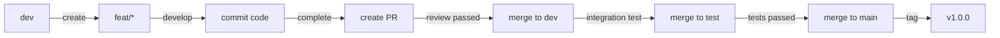

# Git Flow Workflow

**Language**: [English](GIT_FLOW.md) | [中文](GIT_FLOW_CN.md)

## 📋 Table of Contents

- [Overview](#-overview)
- [Branch Strategy](#-branch-strategy)
- [Workflow](#-workflow)
- [Branch Naming Convention](#-branch-naming-convention)
- [Common Scenarios](#-common-scenarios)
- [Best Practices](#-best-practices)
- [FAQ](#-faq)

## 📖 Overview

The FreeTodo project adopts a Git Flow-based branch management strategy to ensure code quality and standardized development processes. This document details our branch model and workflow.

### Core Principles

- 🔒 **Protect Main Branch**: The `main` branch is always stable and deployable
- 🔄 **Continuous Integration**: Continuous feature integration through the `dev` branch
- 🧪 **Thorough Testing**: Complete testing and verification on the `test` branch
- 🌿 **Feature Isolation**: Each feature or fix is developed in an isolated branch
- 👥 **Collaborative Development**: Clear branch strategy facilitates team collaboration

## 🌳 Branch Strategy

### Long-lived Branches

We maintain the following long-lived branches:

#### 1. `main` Branch

- **Purpose**: Production environment branch, contains the most stable code
- **Characteristics**:
  - 🔒 Protected, no direct pushes allowed
  - ✅ All code must go through complete review and testing
  - 🏷️ Each merge should be tagged with a version (e.g., `v1.0.0`)
  - 🚀 Can be directly deployed to production
- **Merge Sources**: Only accepts merges from the `test` branch

#### 2. `dev` Branch

- **Purpose**: Development environment branch for daily development and feature integration
- **Characteristics**:
  - 🔄 Continuous integration of new features
  - 👥 Main collaboration branch for team members
  - 🧪 Relatively stable but may contain untested features
  - 📦 Can be deployed to development environment for internal testing
- **Merge Sources**: Accepts merges from `feat/*` and `fix/*` branches

#### 3. `test` Branch

- **Purpose**: Testing environment branch for complete integration and acceptance testing
- **Characteristics**:
  - 🧪 Used for QA testing and User Acceptance Testing (UAT)
  - ✅ Must pass all test cases
  - 🔍 Performs performance and compatibility testing
  - 📋 Can only be merged to `main` after passing all tests
- **Merge Sources**: Accepts merges from the `dev` branch

### Temporary Branches

The following branch types are temporary and should be deleted after completion:

#### 4. `feat/*` Branches

- **Purpose**: Develop new features
- **Naming Convention**: `feat/brief-description`
- **Examples**:
  - `feat/task-auto-association`
  - `feat/dark-mode`
  - `feat/export-data`
- **Lifecycle**:
  - Created from the `dev` branch
  - Merged back to the `dev` branch when complete
  - Deleted after merging

#### 5. `fix/*` Branches

- **Purpose**: Fix bugs
- **Naming Convention**: `fix/brief-bug-description`
- **Examples**:
  - `fix/screenshot-capture-error`
  - `fix/memory-leak`
  - `fix/login-redirect`
- **Lifecycle**:
  - Created from `dev` branch (development bugs)
  - Created from `test` branch (testing bugs)
  - Created from `main` branch (production emergency bugs, see Hotfix)
  - Merged back to the original branch when complete
  - Deleted after merging

#### 6. `hotfix/*` Branches (Special Case)

- **Purpose**: Fix critical production bugs
- **Naming Convention**: `hotfix/critical-bug-description`
- **Examples**:
  - `hotfix/critical-security-issue`
  - `hotfix/data-loss-bug`
- **Lifecycle**:
  - Created from the `main` branch
  - Merged back to both `main` and `dev` branches when complete
  - Tagged with a patch version on the `main` branch
  - Deleted after merging

## 🔄 Workflow

### Feature Development Flow



### Detailed Steps

#### Step 1: Create Feature Branch

```bash
# Ensure local dev branch is up to date
git checkout dev
git pull origin dev

# Create and switch to new feature branch
git checkout -b feat/your-feature-name
```

#### Step 2: Develop Feature

```bash
# Do your development work
# ... write code ...

# Commit changes regularly
git add .
git commit -m "feat: add new feature description"

# Push to remote regularly (backup and collaboration)
git push origin feat/your-feature-name
```

#### Step 3: Keep Branch Updated

```bash
# Regularly sync latest changes from dev
git checkout dev
git pull origin dev

# Switch back to feature branch
git checkout feat/your-feature-name

# Merge dev updates (rebase recommended)
git rebase dev
# or use merge
git merge dev

# Push updates
git push origin feat/your-feature-name --force-with-lease  # needed after rebase
```

#### Step 4: Create Pull Request

1. Push your branch to GitHub
2. Create a Pull Request on GitHub
3. Select `dev` as the target branch
4. Fill out the PR template describing your changes
5. Wait for code review

#### Step 5: Code Review and Merge

1. Maintainers review the code
2. Make changes based on feedback
3. After review approval, maintainers merge the PR
4. Delete the feature branch

```bash
# After PR is merged, delete local and remote branches
git checkout dev
git pull origin dev
git branch -d feat/your-feature-name
git push origin --delete feat/your-feature-name
```

### Bug Fix Flow

#### Development Environment Bug (found in dev branch)

```bash
# Create fix branch from dev
git checkout dev
git pull origin dev
git checkout -b fix/bug-description

# Fix the bug
# ... write code ...

git add .
git commit -m "fix: resolve bug description"
git push origin fix/bug-description

# Create PR to dev branch
```

#### Testing Environment Bug (found in test branch)

```bash
# Create fix branch from test
git checkout test
git pull origin test
git checkout -b fix/test-bug-description

# After fixing, merge back to test
# Also need to merge to dev to avoid regression
```

#### Production Environment Bug (found in main branch)

```bash
# Create hotfix branch from main
git checkout main
git pull origin main
git checkout -b hotfix/critical-bug

# Fix the bug
# ... write code ...

git add .
git commit -m "fix: resolve critical bug"
git push origin hotfix/critical-bug

# Create PR to main branch
# After merging, also need to merge to dev and test branches
```

### Release Flow

#### From dev to test

```bash
# When dev branch has accumulated enough features, ready to release
git checkout test
git pull origin test

# Merge dev branch
git merge dev

# Push to remote
git push origin test

# Notify testing team to start testing
```

#### From test to main

```bash
# After test branch passes testing
git checkout main
git pull origin main

# Merge test branch
git merge test

# Tag with version
git tag -a v1.0.0 -m "Release version 1.0.0"

# Push to remote (including tag)
git push origin main
git push origin v1.0.0

# Release new version
```

### Version Tagging Convention

We use [Semantic Versioning](https://semver.org/):

- **Format**: `v<major>.<minor>.<patch>`
- **Example**: `v1.2.3`

**Version Number Increment Rules**:

- **MAJOR version**: Incompatible API changes
- **MINOR version**: Backwards-compatible functionality additions
- **PATCH version**: Backwards-compatible bug fixes

```bash
# Examples
v1.0.0  # First official release
v1.1.0  # Add new features
v1.1.1  # Bug fixes
v2.0.0  # Major update, may break compatibility
```

## 📝 Branch Naming Convention

### Naming Format

```
<type>/<description>
```

### Type Categories

| Type | Purpose | Example |
|------|---------|---------|
| `feature` | New feature development | `feat/user-authentication` |
| `fix` | Bug fixes | `fix/login-error` |
| `hotfix` | Emergency fixes | `hotfix/security-patch` |
| `docs` | Documentation updates | `docs/api-documentation` |
| `refactor` | Code refactoring | `refactor/database-layer` |
| `test` | Testing related | `test/unit-tests` |
| `chore` | Build/tools related | `chore/update-dependencies` |
| `perf` | Performance optimization | `perf/query-optimization` |

### Description Naming Rules

- ✅ Use lowercase letters
- ✅ Use hyphens `-` to separate words
- ✅ Be concise and clear, describe branch purpose
- ✅ Use English (for internationalization)
- ❌ Avoid special characters
- ❌ Avoid spaces
- ❌ Avoid overly long names (recommend under 50 characters)

### Naming Examples

```bash
# Good names
feat/task-auto-association
fix/screenshot-capture-windows
docs/contribution-guide
refactor/api-error-handling
test/integration-tests
perf/vector-search-optimization

# Bad names
feat/new_feature  # Don't use underscores
fix/bug              # Too vague
feat/SOMETHING    # Don't use uppercase
feat/这是一个新功能  # Don't use non-English characters
```

## 🎯 Common Scenarios

### Scenario 1: Develop New Feature

```bash
# 1. Update dev branch
git checkout dev
git pull origin dev

# 2. Create feature branch
git checkout -b feat/new-export-function

# 3. Develop feature
# ... write code ...

# 4. Commit changes
git add .
git commit -m "feat(backend): add data export API"

# 5. Push branch
git push origin feat/new-export-function

# 6. Create PR to dev branch on GitHub
```

### Scenario 2: Fix Development Bug

```bash
# 1. Update dev branch
git checkout dev
git pull origin dev

# 2. Create fix branch
git checkout -b fix/api-response-error

# 3. Fix bug
# ... write code ...

# 4. Commit changes
git add .
git commit -m "fix(api): correct error response format"

# 5. Push and create PR
git push origin fix/api-response-error
```

### Scenario 3: Emergency Production Fix

```bash
# 1. Create hotfix branch from main
git checkout main
git pull origin main
git checkout -b hotfix/critical-data-loss

# 2. Fix bug
# ... write code ...

# 3. Commit changes
git add .
git commit -m "fix: prevent data loss in edge case"

# 4. Push and create PR to main
git push origin hotfix/critical-data-loss

# 5. After merging to main, tag with patch version
git checkout main
git pull origin main
git tag -a v1.0.1 -m "Hotfix: critical data loss"
git push origin v1.0.1

# 6. Sync to dev branch
git checkout dev
git merge main
git push origin dev
```

### Scenario 4: Resolve Merge Conflicts

```bash
# 1. Encounter conflicts when trying to merge or rebase
git checkout feat/your-feature
git rebase dev
# Conflict notification

# 2. View conflicted files
git status

# 3. Manually resolve conflicts
# Edit conflicted files, remove conflict markers
# <<<<<<< HEAD
# =======
# >>>>>>> dev

# 4. Mark conflicts as resolved
git add <resolved-file>

# 5. Continue rebase
git rebase --continue

# 6. Force push (history has changed)
git push origin feat/your-feature --force-with-lease
```

### Scenario 5: Sync Hotfix Across Multiple Branches

```bash
# Hotfix has been merged to main
git checkout main
git pull origin main

# 1. Merge to test
git checkout test
git pull origin test
git merge main
git push origin test

# 2. Merge to dev
git checkout dev
git pull origin dev
git merge main
git push origin dev
```

## 💡 Best Practices

### 1. Regularly Sync Upstream Updates

```bash
# Sync dev branch at the start of each day
git checkout dev
git pull origin dev

# Regularly merge dev updates into feature branch
git checkout feat/your-feature
git rebase dev  # Recommended to keep history clean
```

### 2. Keep Commit History Clean

```bash
# Use meaningful commit messages
git commit -m "feat(ui): add dark mode toggle button"

# Squash small commits (before pushing)
git rebase -i HEAD~3  # Interactive rebase last 3 commits

# Use squash when merging PR (optional)
# Combine multiple commits into one logical unit
```

### 3. Pre-Review Checklist

- [ ] Code follows project coding standards
- [ ] All tests pass
- [ ] Necessary tests added
- [ ] Related documentation updated
- [ ] Commit messages follow convention
- [ ] Branch synced with latest dev code
- [ ] No unrelated files or debug code

### 4. Branch Protection Rules

Set protection rules for long-lived branches on GitHub:

**main Branch**:

- ✅ Require PR review (at least 1 approval)
- ✅ Require status checks to pass (CI/CD)
- ✅ Require branch to be up to date
- ✅ Restrict who can push
- ✅ No force pushes allowed

**dev Branch**:

- ✅ Require PR review
- ✅ Require status checks to pass
- ⚠️ Allow maintainers to bypass (special cases)

**test Branch**:

- ✅ Require status checks to pass
- ⚠️ Allow direct pushes (testing needs)

### 5. Regular Branch Cleanup

```bash
# View merged local branches
git branch --merged dev

# Delete merged local branches
git branch -d feat/old-feature

# View remote-deleted but locally existing branches
git remote prune origin --dry-run

# Clean up these branches
git remote prune origin

# Delete all merged local branches (use with caution)
git branch --merged dev | grep -v "\* dev" | xargs -n 1 git branch -d
```

### 6. Use Git Aliases for Efficiency

Add to `~/.gitconfig`:

```ini
[alias]
    # Common command shortcuts
    co = checkout
    br = branch
    ci = commit
    st = status

    # View graphical log
    lg = log --graph --pretty=format:'%Cred%h%Creset -%C(yellow)%d%Creset %s %Cgreen(%cr) %C(bold blue)<%an>%Creset' --abbrev-commit

    # View branch relationships
    tree = log --graph --oneline --all

    # Sync remote branch
    sync = !git fetch origin && git rebase origin/dev

    # Clean up merged branches
    cleanup = !git branch --merged dev | grep -v '\\* dev' | xargs -n 1 git branch -d
```

Usage examples:

```bash
git co dev          # checkout dev
git lg              # View beautified log
git tree            # View branch tree
git sync            # Sync dev branch
git cleanup         # Clean up merged branches
```

## ❓ FAQ

### Q1: Should I use merge or rebase?

**Recommended approach**:

- **Feature branch syncing with dev**: Use `rebase`

  ```bash
  git checkout feat/your-feature
  git rebase dev
  ```

- **Merging to main branches**: Use `merge` (via PR)

  ```bash
  # Use "Squash and merge" or "Merge commit" in GitHub PR
  ```

**Reasoning**:

- `rebase` keeps history linear and easy to understand
- `merge` preserves branch history, convenient for tracking feature development

### Q2: My feature branch is many versions behind dev, what should I do?

```bash
# Method 1: Rebase (recommended, keeps history clean)
git checkout feat/your-feature
git fetch origin
git rebase origin/dev

# If conflicts occur, resolve and continue
git add <resolved-files>
git rebase --continue

# Push (requires force push as history changed)
git push origin feat/your-feature --force-with-lease

# Method 2: Merge (simple, but history will fork)
git checkout feat/your-feature
git merge origin/dev
git push origin feat/your-feature
```

### Q3: I accidentally developed on the main branch, what do I do?

```bash
# 1. Create new feature branch, save current work
git checkout -b feat/accidental-work

# 2. Push to remote
git push origin feat/accidental-work

# 3. Reset main branch to remote state
git checkout main
git reset --hard origin/main

# 4. Continue working on feature branch
git checkout feat/accidental-work
```

### Q4: How do I undo a pushed commit?

```bash
# Method 1: Revert (recommended, creates new commit to undo)
git revert <commit-hash>
git push origin your-branch

# Method 2: Reset + Force Push (dangerous, only for personal branches)
git reset --hard <commit-hash>
git push origin your-branch --force-with-lease
```

⚠️ **Warning**: Never use `--force` push on shared branches (main, dev, test)!

### Q5: PR review requested changes, how do I update?

```bash
# 1. Continue modifying on your feature branch
git checkout feat/your-feature

# 2. Make changes and commit
git add .
git commit -m "fix: address PR review comments"

# 3. Push (will automatically update PR)
git push origin feat/your-feature

# If you want to combine multiple small fixes into one commit
git rebase -i HEAD~3  # Combine last 3 commits
git push origin feat/your-feature --force-with-lease
```

### Q6: How to handle long-running feature branches?

```bash
# 1. Regularly (daily) sync updates from dev
git checkout feat/long-running
git fetch origin
git rebase origin/dev

# 2. Consider splitting into multiple smaller PRs
# Create sub-feature branches
git checkout -b feat/long-running-part1
# Submit PR for partial functionality

# 3. Communicate with team to avoid conflicts
# Inform about features being developed in Issues or discussions
```

### Q7: Team members modified the same file, how to collaborate?

**Best practices**:

1. **Communicate in advance**: Discuss before starting, assign different tasks
2. **Small frequent commits**: Commit small changes frequently, reduce conflicts
3. **Merge promptly**: Review and merge PRs as soon as possible
4. **Resolve conflicts**: When conflicts occur, communicate with related developers

```bash
# If simultaneous modifications are necessary
# 1. Sync frequently
git checkout feat/your-work
git fetch origin
git rebase origin/dev

# 2. Discuss with colleagues when resolving conflicts
# 3. Consider splitting files into smaller modules
```

### Q8: When should I create a hotfix branch?

**Scenarios for creating hotfix**:

- 🚨 Critical bug in production
- 🔒 Security vulnerability needs immediate fix
- 💥 Data integrity issues
- 🛑 Service outage or severe performance issues

**Scenarios NOT needing hotfix**:

- Regular bugs (use `fix/*` branch through normal process)
- Minor UI issues
- Feature improvements
- Documentation updates

### Q9: How to find which version introduced a feature?

```bash
# View modification history of a file
git log --follow -- path/to/file

# View tags containing a specific feature
git tag --contains <commit-hash>

# View differences between two versions
git log v1.0.0..v1.1.0 --oneline

# Search commit messages
git log --grep="feature name"
```

### Q10: My branch is messy, how to start fresh?

```bash
# 1. Backup current work (if uncommitted changes)
git stash

# 2. Create new clean branch
git checkout dev
git pull origin dev
git checkout -b feat/clean-start

# 3. Cherry-pick needed commits
git cherry-pick <commit-hash1>
git cherry-pick <commit-hash2>

# 4. Or start development from scratch
# Manually copy code, commit again

# 5. Delete old branch
git branch -D feat/old-messy-branch
git push origin --delete feat/old-messy-branch
```

## 📚 Reference Resources

### Git Learning Resources

- [Pro Git Book](https://git-scm.com/book/en/v2)
- [Git Simple Guide](https://rogerdudler.github.io/git-guide/)
- [A Successful Git Branching Model](https://nvie.com/posts/a-successful-git-branching-model/)
- [GitHub Flow](https://docs.github.com/en/get-started/quickstart/github-flow)

### Recommended Git Tools

- **Command Line Tools**:
  - [tig](https://jonas.github.io/tig/) - Text-mode interface for Git
  - [lazygit](https://github.com/jesseduffield/lazygit) - Terminal UI tool

- **Graphical Interfaces**:
  - [GitKraken](https://www.gitkraken.com/) - Cross-platform Git client
  - [Sourcetree](https://www.sourcetreeapp.com/) - Free Git client
  - [GitHub Desktop](https://desktop.github.com/) - Official GitHub client

- **VS Code Extensions**:
  - GitLens - Enhanced Git functionality
  - Git Graph - Visualize branch graph
  - Git History - View file history

## 🎓 Git Command Cheat Sheet

### Basic Operations

```bash
# Clone repository
git clone <repository-url>

# Check status
git status

# Add files to staging
git add <file>
git add .

# Commit changes
git commit -m "message"

# Push to remote
git push origin <branch>

# Pull remote changes
git pull origin <branch>
```

### Branch Operations

```bash
# View branches
git branch
git branch -a  # Include remote branches

# Create branch
git branch <branch-name>

# Switch branch
git checkout <branch-name>

# Create and switch to new branch
git checkout -b <branch-name>

# Delete local branch
git branch -d <branch-name>
git branch -D <branch-name>  # Force delete

# Delete remote branch
git push origin --delete <branch-name>
```

### Merge and Rebase

```bash
# Merge branch
git merge <branch-name>

# Rebase
git rebase <branch-name>

# Interactive rebase
git rebase -i HEAD~3

# Continue after resolving conflicts
git rebase --continue

# Abort rebase
git rebase --abort
```

### Remote Operations

```bash
# View remote repositories
git remote -v

# Add remote repository
git remote add origin <url>

# Fetch remote updates
git fetch origin

# Sync remote deleted branches
git remote prune origin
```

### Undo and Reset

```bash
# Undo working directory changes
git checkout -- <file>

# Unstage
git reset HEAD <file>

# Undo commit (keep changes)
git reset --soft HEAD~1

# Undo commit (discard changes)
git reset --hard HEAD~1

# Revert commit (create new commit)
git revert <commit-hash>
```

### View History

```bash
# View commit history
git log
git log --oneline
git log --graph --all

# View file history
git log -- <file>

# View commit details
git show <commit-hash>

# View diff between commits
git diff <commit1> <commit2>
```

### Tag Operations

```bash
# Create tag
git tag v1.0.0
git tag -a v1.0.0 -m "Release version 1.0.0"

# Push tag
git push origin v1.0.0
git push origin --tags  # Push all tags

# Delete tag
git tag -d v1.0.0
git push origin --delete v1.0.0
```

## 🚦 Workflow Diagram

### Complete Feature Development Flow

```
Developer forks repository
    ↓
Clone to local
    ↓
Create feat/* branch ← dev branch
    ↓
Local development and testing
    ↓
Commit code
    ↓
Push to GitHub
    ↓
Create Pull Request → dev branch
    ↓
Code review
    ↓
CI/CD automated testing
    ↓
Review approved
    ↓
Merge to dev branch
    ↓
Integration testing
    ↓
Merge to test branch
    ↓
Complete testing
    ↓
Merge to main branch
    ↓
Tag version
    ↓
Release
```

---

## 📞 Get Help

If you have any questions about Git Flow:

1. 📖 Check the FAQ section of this document
2. 💬 Ask in GitHub Discussions
3. 🐛 Create an Issue if you find documentation errors
4. 👥 Consult project maintainers or experienced contributors

---

**Remember**: A good Git workflow is not just a technical issue, it's the foundation of team collaboration. Follow the conventions, maintain communication, and together we'll build a better FreeTodo! 🚀
