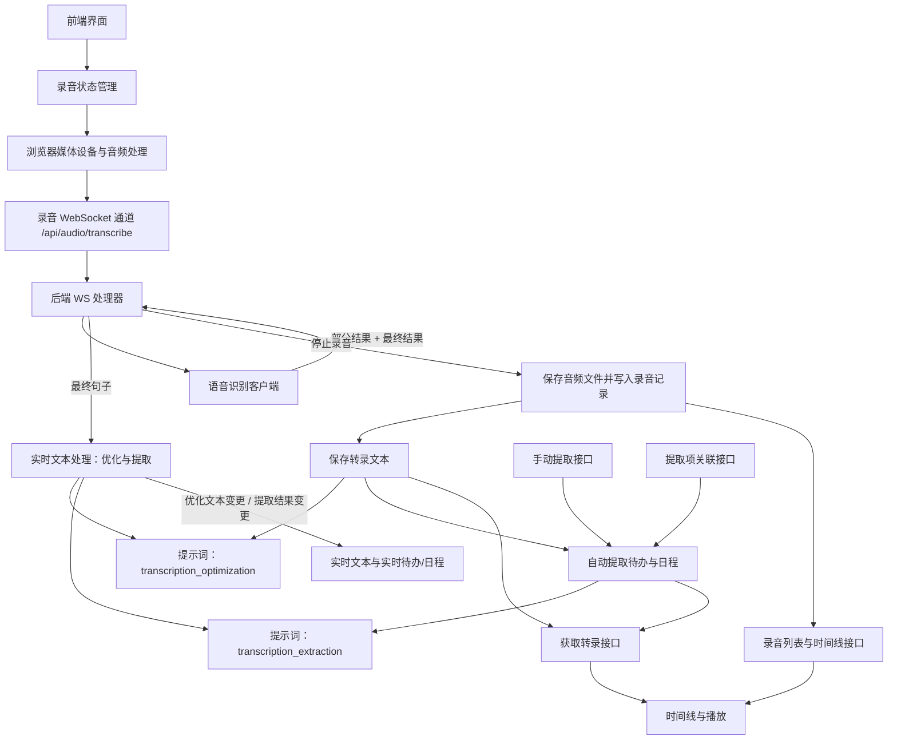

# 音频模块流程总结

本文档总结了音频录制与提取的端到端流程。

## 概览

音频模块在前端采集麦克风输入，通过 WebSocket 把 PCM16 流发送到后端；后端进行实时 ASR，可选实时优化与提取，并在停止录制时持久化录音与转录。提取出的待办/日程会写入转录记录，并可与实际待办项进行关联。

## 端到端流程图

## 备注

- 前端将原始 PCM16（16 kHz、单声道）流发送到后端 WebSocket。
- 后端把 PCM 封装为 WAV，保存文件并写入录音数据库记录。
- 停止录音时保存转录文本；文本变化后会异步触发自动提取。
- 实时文本处理只在最终句子上运行，并有节流以降低负载。
- 提取结果存储在转录记录的 JSON 字段中，可通过接口关联到实际待办。
