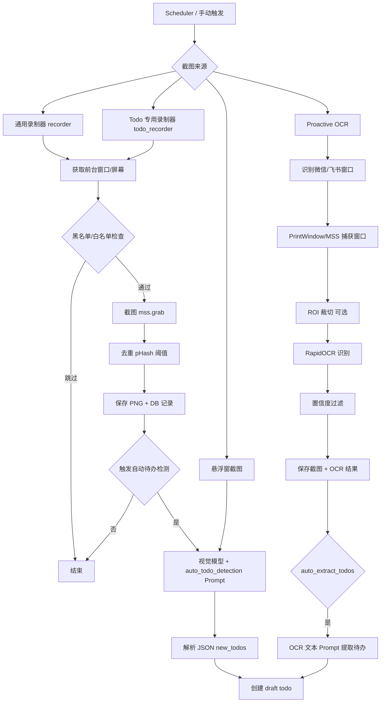

# 屏幕截图获取待办：原理与完整流程（LifeTrace）

> 本文基于后端实现源码整理，重点覆盖“截图 -> 待办”的端到端流程。
> 相关实现文件：
> - 截图/录制：`lifetrace/jobs/recorder.py`, `lifetrace/jobs/recorder_capture.py`, `lifetrace/jobs/todo_recorder.py`
> - 主动 OCR：`lifetrace/jobs/proactive_ocr/*`
> - 待办检测：`lifetrace/llm/auto_todo_detection_service.py`, `lifetrace/llm/ocr_todo_extractor.py`
> - 视觉模型：`lifetrace/llm/llm_client_vision.py`
> - 提示词：`lifetrace/config/prompts/todo.yaml`

---

## 1. “截图获取待办”完整流程总览

**核心主线：**
1. **触发截图**：调度器周期任务（`recorder_job` / `todo_recorder_job` / `proactive_ocr_job`）或手动悬浮窗截图。
2. **捕获画面**：获取前台窗口信息 → 黑白名单过滤 → 使用 `mss` / `PrintWindow` 采集图像。
3. **去重与保存**：基于感知哈希（pHash）去重；保存 PNG 文件；将元数据写入 DB（`Screenshot`）。
4. **待办检测**：
   - **视觉模型路径**：基于截图调用多模态模型 → 解析 JSON → 创建 draft 待办。
   - **Proactive OCR 路径**：窗口截图 → OCR 文本 → 文本型 LLM 提取 → 创建 draft 待办。

---

## 2. 屏幕截图原理与采集频率

### 2.1 通用录制器（`jobs.recorder`）
- **采集频率**：`jobs.recorder.interval`（默认 **10 秒**）。
- **采集原理**：
  - 获取前台窗口信息：`get_active_window_info()`（跨平台）。
  - 获取前台窗口所在屏幕：`get_active_window_screen()`。
  - **只截取前台窗口所在屏幕**（即使配置 `screens: all` 也以活跃屏幕为准）。
  - 使用 `mss.mss().grab(monitor)` 截取屏幕。
  - **去重**：对内存图像计算 pHash（`imagehash.phash`），与上一次截图哈希比较，低于阈值则跳过保存。
  - 保存 PNG 文件；计算文件 MD5；写入 DB；记录应用名/窗口标题。
- **黑名单/自排除**：
  - `jobs.recorder.params.blacklist` 支持应用/窗口黑名单。
  - `auto_exclude_self` 自动排除 LifeTrace 自身窗口。
- **待办检测触发**：若启用 `jobs.auto_todo_detection.enabled` 且应用在白名单中，异步触发自动待办检测。

### 2.2 Todo 专用录制器（`jobs.todo_recorder`）
- **采集频率**：`jobs.todo_recorder.interval`（默认 **5 秒**）。
- **采集原理**：
  - 仅在前台窗口属于白名单应用时截图（白名单来自 `jobs.auto_todo_detection.params.whitelist.apps`）。
  - 独立维护去重哈希（与通用录制器隔离）。
  - 保存 PNG + 写入 DB，并立即触发自动待办检测（异步线程）。
- **联动机制**：
  - `jobs.todo_recorder.enabled` 与 `jobs.auto_todo_detection.enabled` 在配置层联动。

### 2.3 Proactive OCR（`jobs.proactive_ocr`）
- **采集频率**：`jobs.proactive_ocr.interval`（默认 **1.0 秒**）。
- **采集原理**：
  - 识别前台窗口是否为目标应用（微信 / 飞书），基于进程名和窗口标题。
  - **Windows 优先 PrintWindow**（可捕获被遮挡窗口），失败回退 MSS；非 Windows 使用 MSS。
  - 可选 ROI 裁切（聊天区域）提升 OCR 速度与准确性。
  - OCR 结果按 `min_confidence` 过滤，仅保留高置信度文本。
  - 保存截图 + OCR 结果到 DB。
  - 可选 `auto_extract_todos=true` 时自动触发 OCR 文本待办提取。

### 2.4 OCR 扫描任务（`jobs.ocr`，补充）
- **采集频率**：`jobs.ocr.interval`（默认 **10 秒**）。
- **作用**：扫描数据库中未 OCR 的截图，用于搜索/摘要等，不是“截图→待办”的主路径。

---

## 3. 从截图提取待办的关键流程

### 3.1 自动待办检测（视觉模型，单张截图）
- **触发点**：
  - 通用录制器（截图后）
  - Todo 专用录制器（截图后）
  - 悬浮窗截图接口
- **数据准备**：
  - `screenshot_id` → `get_screenshots_base64()` → 视觉模型输入。
  - 同时传入“已有待办列表”用于去重。
- **提示词**：使用 `auto_todo_detection`（见后文“Prompts”）。
- **模型输出**：解析 JSON `{ "new_todos": [...] }`。
- **落库**：
  - 生成 draft todo（`status="draft"`），`tags=["自动提取"]`。
  - `user_notes` 中记录来源截图、应用/窗口、来源文本、时间信息、置信度。

### 3.2 Proactive OCR + OCR 文本待办
- **触发点**：`jobs.proactive_ocr` OCR 结果写入后。
- **流程**：
  1. OCR 文本标准化并计算 hash。
  2. 若与已有 OCR 文本重复或在 60s 内触发过，跳过 LLM。
  3. 用 `auto_todo_detection` prompt + OCR 文本调用 LLM。
  4. 本地去重（标题+时间）后创建 draft todo。
- **去重与限流**：
  - 同文本 60s 内不重复调用 LLM。
  - 内存缓存 TTL 1 小时。
  - 本地去重：`(title, scheduled_time)`。

### 3.3 悬浮窗截图（手动）
- **接口**：`/api/floating-capture/extract-todos`
- **流程**：前端传入 base64 图片 → 视觉模型提取待办 → 可选创建 draft todo（`tags=["悬浮窗提取"]`）。

---

## 4. 关键配置默认值（来自 `default_config.yaml`）

```yaml
jobs:
  recorder:
    enabled: false
    interval: 10
    params:
      deduplicate: true
      hash_threshold: 5
      auto_exclude_self: true
      blacklist:
        enabled: false
  auto_todo_detection:
    enabled: false
    params:
      whitelist:
        apps: ["微信", "WeChat", "飞书", "Feishu", "Lark", "钉钉", "DingTalk"]
  todo_recorder:
    enabled: false
    interval: 5
    params:
      deduplicate: true
      hash_threshold: 5
  ocr:
    enabled: false
    interval: 10
    params:
      confidence_threshold: 0.5
  proactive_ocr:
    enabled: false
    interval: 1.0
    params:
      use_roi: true
      resize_max_side: 800
      det_limit_side_len: 640
      min_confidence: 0.8
      auto_extract_todos: true
      min_text_length: 5
```

---

## 5. Mermaid 流程图



---

## 6. Prompts（原样收录）

### 6.1 `todo_extraction.system_assistant`
```text
你是一个专业的待办事项提取助手，擅长从聊天记录、会议记录等截图中识别用户可能承诺的待办事项。

你的任务是：
1. 识别用户明确承诺、答应或可能要做的事项（包括讨论中的待办）
2. 提取待办事项的标题、描述和时间信息
3. 区分相对时间（如"明天"、"下周"）和绝对时间（如"2024-01-15 13:00"）
4. **宽松提取原则**：即使不是100%确定，只要有一定可能性是待办事项，就可以提取
5. **置信度评估**：根据确定性给出合理的置信度（0.5-0.9），不确定的可以给较低置信度（0.5-0.7）

请用中文回答，保持准确和简洁。
```

### 6.2 `todo_extraction.user_prompt`
```text
你是一个待办事项提取助手。请从以下应用对话/会议记录的截图中提取用户可能承诺的待办事项。

**应用信息：**
- 应用名称：{app_name}
- 窗口标题：{window_title}
- 事件时间范围：{start_time} 至 {end_time}

**提取要求（宽松原则）：**
1. **提取范围扩大**：不仅提取明确承诺，也提取可能的待办事项，包括：
   - 明确承诺："我会..."、"我明天..."、"我答应..."、"好的，我..."等
   - 计划讨论："我们可能需要..."、"应该要..."、"记得..."等
   - 任务分配："你负责..."、"我来处理..."等
   - 时间约定："明天见"、"下周讨论"等（如果涉及具体事项）
2. **提取时间信息**：
   - 如果提到了具体时间（如"明天下午3点"、"下周一"、"13:00"），提取并分类为相对时间或绝对时间
   - 相对时间：基于事件时间范围计算（如"明天"相对于事件开始时间）
   - 绝对时间：明确的日期时间（如"2024-01-15 13:00:00"）
   - 如果没有明确时间，time_info可以为null
3. **提取待办内容**：提取用户承诺、计划或讨论要做的具体事情
4. **置信度评估**：
   - 明确承诺：置信度 0.8-0.9
   - 计划讨论：置信度 0.6-0.7
   - 可能的待办：置信度 0.5-0.6
   - 不确定时宁可提取并给较低置信度，让用户后续确认

**时间格式要求：**
- 相对时间：
  - relative_days: 相对天数（0=今天，1=明天，2=后天）
  - relative_time: 24小时制时间字符串（如"13:00", "15:30"）
  - raw_text: 原始时间文本（如"明天下午1点"）
- 绝对时间：
  - absolute_time: ISO 8601格式（如"2024-01-15T13:00:00"）
  - raw_text: 原始时间文本

**请以JSON格式返回：**
{
  "todos": [
    {
      "title": "待办标题（简洁，不超过20字）",
      "description": "待办描述（可选，详细说明）",
      "time_info": {
        "time_type": "relative" 或 "absolute",
        "relative_days": 1 或 null,
        "relative_time": "13:00" 或 null,
        "absolute_time": "2024-01-15T13:00:00" 或 null,
        "raw_text": "原始时间文本（如：明天下午1点）"
      },
      "source_text": "来源文本片段（用于验证）",
      "confidence": 0.7
    }
  ]
}

如果没有发现待办事项，返回：
{
  "todos": []
}

只返回JSON，不要返回其他任何信息。
```

### 6.3 `auto_todo_detection.system_assistant`
```text
你是一个专业的待办事项检测助手，擅长从单张截图中识别用户可能承诺的新待办事项。

你的任务是：
1. 识别用户明确承诺、答应或可能要做的事项（包括讨论中的待办）
2. 提取待办事项的标题、描述和时间信息
3. 区分相对时间（如"明天"、"下周"）和绝对时间（如"2024-01-15 13:00"）
4. **宽松提取原则**：即使不是100%确定，只要有一定可能性是待办事项，就可以提取
5. **置信度评估**：根据确定性给出合理的置信度（0.5-0.9），不确定的可以给较低置信度（0.5-0.7）
6. **避免与已有待办重复**（对比标题和描述）

请用中文回答，保持准确和简洁。
```

### 6.4 `auto_todo_detection.user_prompt`
```text
请分析这张截图，检测用户新承诺的待办事项。

**要求（宽松原则）：**
1. **提取范围扩大**：不仅提取明确承诺，也提取可能的待办事项，包括：
   - 明确承诺："我会..."、"我明天..."、"我答应..."、"好的，我..."等
   - 计划讨论："我们可能需要..."、"应该要..."、"记得..."等
   - 任务分配："你负责..."、"我来处理..."等
   - 时间约定："明天见"、"下周讨论"等（如果涉及具体事项）
2. **避免重复**：不要提取与已有待办列表中相同或相似的待办事项
3. **提取时间信息**：
   - 如果提到了具体时间（如"明天下午3点"、"下周一"、"13:00"），提取并分类为相对时间或绝对时间
   - 相对时间：基于当前时间计算（如"明天"相对于今天）
   - 绝对时间：明确的日期时间（如"2024-01-15 13:00:00"）
   - 如果没有明确时间，time_info可以为null
4. **提取待办内容**：提取用户承诺、计划或讨论要做的具体事情
5. **置信度评估**：
   - 明确承诺：置信度 0.8-0.9
   - 计划讨论：置信度 0.6-0.7
   - 可能的待办：置信度 0.5-0.6
   - 不确定时宁可提取并给较低置信度，让用户后续确认

**已有待办列表（请避免重复）：**
{existing_todos_json}

**时间格式要求：**
- 相对时间：
  - relative_days: 相对天数（0=今天，1=明天，2=后天）
  - relative_time: 24小时制时间字符串（如"13:00", "15:30"）
  - raw_text: 原始时间文本（如"明天下午1点"）
- 绝对时间：
  - absolute_time: ISO 8601格式（如"2024-01-15T13:00:00"）
  - raw_text: 原始时间文本

**请以JSON格式返回：**
{
  "new_todos": [
    {
      "title": "待办标题（简洁，不超过20字）",
      "description": "待办描述（可选，详细说明）",
      "time_info": {
        "time_type": "relative" 或 "absolute",
        "relative_days": 1 或 null,
        "relative_time": "13:00" 或 null,
        "absolute_time": "2024-01-15T13:00:00" 或 null,
        "raw_text": "原始时间文本（如：明天下午1点）"
      },
      "source_text": "来源文本片段（用于验证）",
      "confidence": 0.7
    }
  ]
}

如果没有发现新待办事项，返回：
{
  "new_todos": []
}

只返回JSON，不要返回其他任何信息。
```

### 6.5 Proactive OCR 路径的“运行时追加规则”（OCR 文本模式）
> 该段不是配置文件中的 prompt，而是在 OCR 文本路径中动态拼接到 `auto_todo_detection.user_prompt` 之后。

```text
重要规则：
1. 如果候选待办在当前已有待办列表中已经存在（尤其是标题和时间信息相同或非常相似），请不要重复输出这些待办，仅输出真正新的待办。
2. 可以适当润色标题，但不要把同一条待办拆分成多条含义相同的待办。

当前应用：{app_name}
窗口标题：{window_title}
OCR 文本内容如下，请仅基于这些文本提取新的待办事项：
{text_content}
```
